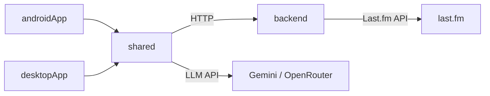

# Sonic Signature

IEM recommendation app. You search for songs you enjoy, add them to a listening profile, and an LLM recommends In-Ear Monitors (IEMs) that match the sonic characteristics of your music taste — powered by Last.fm metadata and community-driven tags.

## Architecture

Kotlin Multiplatform. Four Gradle modules:



- **shared** — ViewModels, API clients, recommendation engine. Common code for all platforms.
- **androidApp** — Compose UI targeting Android.
- **desktopApp** — Compose Desktop (JVM).
- **backend** — Ktor server. Proxies Last.fm API requests and keeps the API key server-side.

### Data Flow

1. **User searches** for songs → `MusicClient` calls backend → backend queries Last.fm `track.search`
2. **User selects** one or more songs → displayed as removable chips
3. **User taps "Find My IEM"** → `RecommendationEngine` fetches Last.fm tags for each song → builds a combined prompt → calls the LLM
4. **LLM returns** 3 IEM recommendations as structured JSON → parsed and displayed

## Prerequisites

- JDK 17+
- Android SDK (API 34)
- A **Last.fm API key** — free at https://www.last.fm/api/account/create
- An **LLM API key** (Gemini or OpenRouter)

## Setup

1. Clone the repo.

2. Create `backend/.env`:
```
LASTFM_API_KEY=your_lastfm_api_key
```

## Running

Start the backend first, then the app.

**Backend:**
```bash
./gradlew :backend:run
```

**Android (emulator):**
```bash
./gradlew :androidApp:installDebug
```
Default backend URL points to `10.0.2.2:8080` (emulator alias for host localhost).

**Android (physical device):**

Set your machine's local IP in `AppNavGraph.kt`:
```kotlin
BackendConfig.baseUrl = "http://<YOUR_LOCAL_IP>:8080"
```
Phone and computer must be on the same network.

**Desktop:**
```bash
./gradlew :desktopApp:run
```
Backend URL is set to `localhost:8080` automatically.

## Configuration

Open the app → Settings → select your LLM provider (Gemini or OpenRouter) → enter your API key. Keys are stored in platform-specific secure storage (Android Keystore / encrypted preferences on desktop).

Last.fm API key lives exclusively in `backend/.env`. The app has no knowledge of it.

### Budget Tiers

| Tier | Price Range |
|------|------------|
| Ultra-Budget | <₹1,000 |
| Entry | ₹2,000–₹6,500 |
| Mid-Range | ₹8,000–₹40,000 |
| High-End | >₹80,000 |

### Input Modes

| Mode | How it works |
|------|-------------|
| **Song** | Search & select multiple songs → tags fetched from Last.fm → LLM analyzes combined profile |
| **Artist** | Type artist names as chips → LLM infers sonic characteristics |
| **Genre/Mood** | Free-text description → LLM recommends based on described preferences |

## Project Structure

```
sonic-signature/
  backend/
    .env                              # Last.fm API key (gitignored)
    src/main/kotlin/.../
      Application.kt                 # Ktor entry point
      service/LastFmService.kt        # Reads LASTFM_API_KEY from .env
      routes/LastFmProxyRoutes.kt     # /api/music/search, /api/music/tags
  shared/
    src/commonMain/kotlin/.../
      api/
        MusicClient.kt               # Last.fm search + tags via backend proxy
        BackendConfig.kt              # Backend URL configuration
        LLMClientFactory.kt           # Creates Gemini/OpenRouter providers
        GeminiProvider.kt             # Gemini API client
        OpenRouterProvider.kt         # OpenRouter API client
      engine/
        RecommendationEngine.kt       # Orchestrates: tags → prompt → LLM → parse
        PromptBuilder.kt              # Builds structured LLM prompts
        RecommendationParser.kt       # Parses JSON responses to IEMRecommendation
      model/
        SongMetadata.kt               # Track name, artist, album art URL
        TrackTags.kt                  # Last.fm tags (genre, mood, style)
        IEMRecommendation.kt          # IEM name, brand, price, justification
        BudgetTier.kt                 # Ultra-Budget / Entry / Mid-Range / High-End
      viewmodel/
        SearchViewModel.kt            # Debounced song search
        RecommendationViewModel.kt    # Multi-song selection, input modes, results
        SettingsViewModel.kt          # LLM provider configuration
      storage/
        SecureVault.kt                # expect/actual secure key storage
  androidApp/                         # Compose UI + navigation
  desktopApp/                         # Compose Desktop window
```

