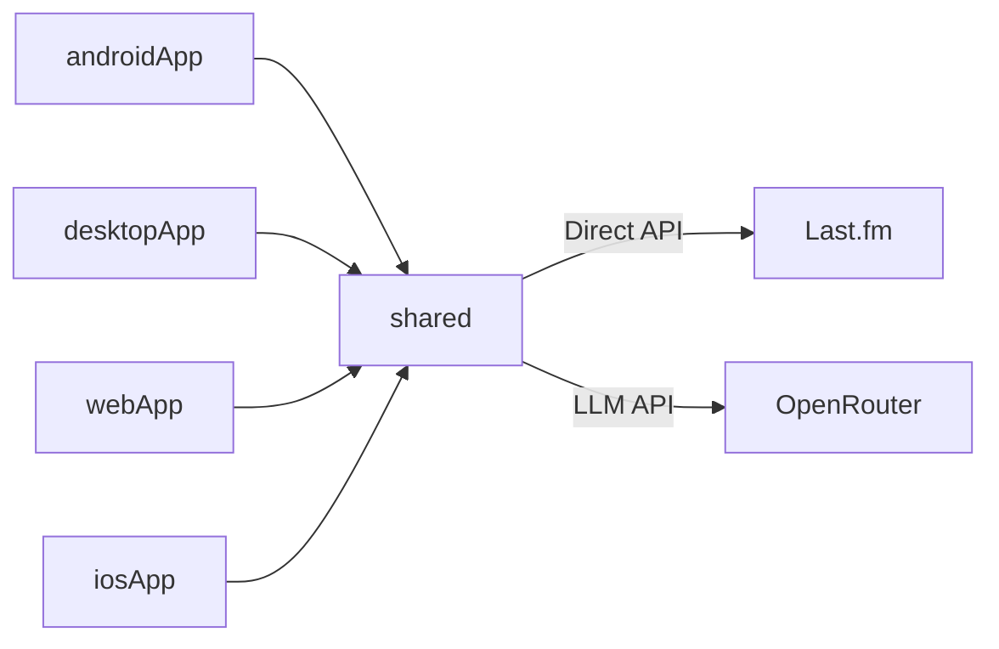

# Sonic Signature

IEM recommendation app. You search for songs you enjoy, add them to a listening profile, and an LLM recommends In-Ear Monitors (IEMs) that match the sonic characteristics of your music taste — powered by Last.fm metadata and community-driven tags.

## Architecture

Kotlin Multiplatform. Four Gradle modules plus an iOS Xcode host:



- **shared** — ViewModels, API clients, recommendation engine. Common code for all platforms.
- **androidApp** — Compose UI targeting Android.
- **desktopApp** — Compose Desktop (JVM).
- **webApp** — Compose Multiplatform for Wasm.
- **iosApp** — Xcode host that launches the shared Compose UI.

> **Note:** The `backend/` module is deprecated. The app now calls the Last.fm API directly using the user's own API key — no backend server required.

### Data Flow

1. **User searches** for songs → `MusicClient` calls Last.fm `track.search` directly
2. **User selects** one or more songs → displayed as removable chips
3. **User taps "Find My IEM"** → `RecommendationEngine` fetches Last.fm tags for each song → builds a combined prompt → calls the LLM
4. **LLM returns** 3 IEM recommendations as structured JSON → parsed and displayed

## Prerequisites

- JDK 17+
- Android SDK with API 36 installed
- A **Last.fm API key** — free at https://www.last.fm/api/account/create
- An **OpenRouter API key** for recommendations

→ **[Getting your API keys (SETUP.md)](SETUP.md)**


## Setup

1. Clone the repo.
2. Open the app → Settings → enter your **Last.fm API key** and **OpenRouter API key**.

That's it — no backend server to run.

## Running

**Android (emulator or physical device):**
```bash
./gradlew :androidApp:installDebug
```

**Desktop:**
```bash
./gradlew :desktopApp:run
```

## Configuration

Open the app → Settings:
1. **Music Data** — enter your Last.fm API key (free). Keys are validated before saving.
2. **AI Provider** — enter your OpenRouter API key and optional model ID.

All keys are stored in platform-specific secure storage:
- **Android**: AES-256-GCM values encrypted by an AES key in Android Keystore.
- **iOS**: Apple Keychain via `KeychainSettings`.
- **Desktop**: AES-256-GCM encrypted JVM Preferences (key stored at `~/.sonic-signature/vault.key`)
- **Web/Wasm**: Browser local storage with lightweight obfuscation only. Use the web build for convenience, not for high-value API keys.

### Budget Tiers

| Tier | Price Range |
|------|------------|
| Ultra-Budget | <₹1,000 |
| Entry | ₹2,000–₹6,500 |
| Mid-Range | ₹8,000–₹40,000 |
| High-End | >₹80,000 |

### Input Modes

| Mode | How it works |
|------|-------------|
| **Song** | Search & select multiple songs → tags fetched from Last.fm → LLM analyzes combined profile |
| **Artist** | Type artist names as chips → LLM infers sonic characteristics |
| **Genre/Mood** | Free-text description → LLM recommends based on described preferences |

### Graceful Degradation

Without a Last.fm API key, **Song search is disabled** but:
- **Artist mode** still works (LLM-only)
- **Genre/Mood mode** still works (LLM-only)

## Project Structure

```
sonic-signature/
  shared/
    src/commonMain/kotlin/.../
      api/
        MusicClient.kt               # Direct Last.fm search + tags (user's own key)
        LLMClientFactory.kt           # Creates the active OpenRouter provider
        GeminiProvider.kt             # Legacy client; not currently selected by settings
        OpenRouterProvider.kt         # OpenRouter API client
      engine/
        RecommendationEngine.kt       # Orchestrates: tags → prompt → LLM → parse
        PromptBuilder.kt              # Builds structured LLM prompts
        RecommendationParser.kt       # Parses JSON responses to IEMRecommendation
      model/
        SongMetadata.kt               # Track name, artist, album art URL
        TrackTags.kt                  # Last.fm tags (genre, mood, style)
        IEMRecommendation.kt          # IEM name, brand, price, justification
        BudgetTier.kt                 # Ultra-Budget / Entry / Mid-Range / High-End
      viewmodel/
        SearchViewModel.kt            # Debounced song search
        RecommendationViewModel.kt    # Multi-song selection, input modes, results
        SettingsViewModel.kt          # LLM + Last.fm key configuration
      storage/
        SecureVault.kt                # expect/actual secure key storage
        VaultKeys.kt                  # Key constants (LLM, Last.fm, model ID)
  androidApp/                         # Compose UI + navigation
  desktopApp/                         # Compose Desktop window
  webApp/                             # Compose Wasm host
  iosApp/                             # Xcode host for shared Compose UI
  backend/                            # [DEPRECATED] No longer required
```
